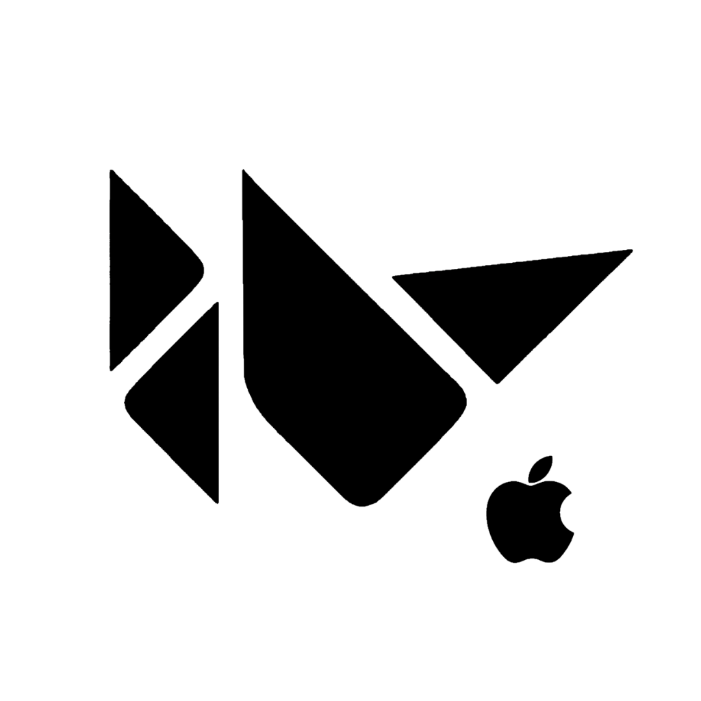

# Kivy Cupertino

A collection of iOS style widgets for Kivy. Kivy Cupertino is currently in **alpha** version.
Many widgets are not yet implemented and stability is not guaranteed


[](https://github.com/cmdvmd/kivy-cupertino/issues)
[](LICENSE)
[](https://github.com/cmdvmd/kivy-cupertino/commits/main)

## Installation

> :warning: **Warning:** Kivy Cupertino is not yet published on pypi. The below command will not work

```shell
pip install kivycupertino
```

### Dependencies

- [Kivy](https://kivy.org/doc/stable/gettingstarted/installation.html)
- [Python 3](https://www.python.org/downloads/)

## Examples

Check out the [Showcase app](examples/showcase.py) for an example of all widgets in Kivy Cupertino

## Widgets

| Widget | Status |
|--------|--------|
| Action Sheet | :heavy_check_mark: |
| Activity Indicator | :memo: |
| Alert Dialog | :heavy_check_mark: |
| Button | :heavy_check_mark: |
| Icon Button | :construction: |
| Label | :heavy_check_mark: |
| Navigation Bar | :heavy_check_mark: |
| Progress Bar | :heavy_check_mark: |
| Search Bar | :memo: |
| Segmented Controls | :construction: |
| Slider | :memo: |
| Stepper | :heavy_check_mark: |
| Switch | :heavy_check_mark: |
| System Button | :heavy_check_mark: |
| Text Field | :memo: |

### Key

:heavy_check_mark: Added
\
:construction: Work in Progress
\
:memo: Planned

## Contributing

To help improve this project, [fork this repository](https://github.com/cmdvmd/kivy-cupertino/fork)
