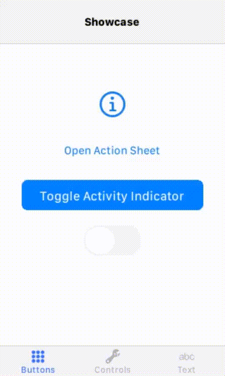

Kivy Cupertino
==============

.. image:: _static/mail_app.png

Kivy Cupertino is a collection of iOS style widgets following
`Apple's Human Interface guidelines <https://developer.apple.com/design/human-interface-guidelines/>`_
to be used with the `Kivy <https://kivy.org/#home>`_ cross-platform graphical framework without sacrificing
ease of use or application performance.

.. warning::
   We are currently in **beta** status; most widgets have been implemented but stability is not
   guaranteed. We don't recommend using Kivy Cupertino in production.

Installation
------------

To install Kivy Cupertino from `PyPi <https://pypi.org/project/kivycupertino>`_, use ``pip``:

.. code-block:: console

   $ pip install kivycupertino

To use newly implemented widgets that have not yet been published to PyPI, install from GitHub
(**not recommended for production use**):

.. code-block:: console

   $ pip install git+https://github.com/cmdvmd/kivy-cupertino.git

To install Kivy Cupertino for development use, install with the `dev` extra:

.. toctree::
   :hidden:
   :caption: Contents

   Home <self>
   _source/bar
   _source/behavior
   _source/button
   _source/control
   _source/indicator
   _source/label
   _source/modal
   _source/page
   _source/scrollview
   _source/slider
   _source/swipe
   _source/switch
   _source/symbol
   _source/table
   _source/textinput

Contributing
------------

To help improve this project, `fork our repository <https://github.com/cmdvmd/kivy-cupertino/fork>`_ and install Kivy Cupertino with the ``dev`` extra:

.. code-block:: console

   $ pip install kivycupertino[dev]

Visit the `projects page <https://github.com/cmdvmd/kivy-cupertino/projects>`_ to view pending projects
you may be able to work on

License
-------

Kivy Cupertino is licensed under the MIT license

.. literalinclude:: ../LICENSE
   :language: text

Indices and tables
==================

* :ref:`genindex`
* :ref:`modindex`
* :ref:`search`